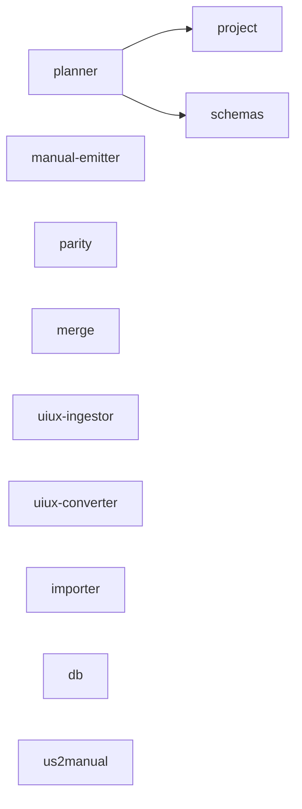

# Architecture Overview

## 1. Title & Scope

- **Repository**: `Ai_Testing_Framework`
- **Purpose**:
  - Generate, tune, and validate QA manuals from US inputs with deterministic outputs
  - Provide workspace packages for planning, emitting manuals, parity scoring, and utilities
  - Enforce process governance via ADEF (logging, config, and quality gates)
- **Primary languages**: TypeScript (Node 22+), Python (ADEF tooling)
- **Package manager**: `pnpm` (workspace root `qa-framework`)
- **Module system**: ESM (`"type": "module"`), TS target/module ES2022

## 2. Workspace Map (tree view)

Tree (depth 2–3) of the repo and `qa-framework/`:

```bash
D:\Proj\Ai_Testing_Framework
├── ADEF
│  ├── config
│  │  └── environments
│  │     └── development.yml
│  ├── framework
│  │  ├── config
│  │  │  └── quality_gates.yml
│  │  ├── docs
│  │  ├── src
│  │  │  ├── infrastructure
│  │  │  └── shared
│  │  └── README.md
│  ├── scripts
│  │  └── verify_adef_integration.py
│  └── tools
│     └── check_quality_gates.py
├── qa-framework
│  ├── package.json
│  ├── tsconfig.base.json
│  ├── packages
│  │  ├── db
│  │  ├── importer
│  │  ├── manual-emitter
│  │  ├── merge
│  │  ├── parity
│  │  ├── planner
│  │  ├── project
│  │  ├── rules
│  │  ├── schemas
│  │  ├── uiux-converter
│  │  ├── uiux-ingestor
│  │  └── us2manual
│  ├── projects
│  │  └── example
│  │     └── standards
│  │        ├── coverage
│  │        ├── data_profiles.yaml
│  │        └── selectors.yaml
│  ├── tools
│  │  └── us2manual.mjs
│  └── docs
│     └── modules
├── US_input
├── Manual_output
└── finalize_module*.ps1
```

Helper inventory generation (Node ESM):

```bash
node tmp/analysis/inventory.mjs
# Output:
WROTE tmp/analysis/inventory.json
```

## 3. Packages Inventory (workspaces)

| Package | Version | Private | Type (app/pkg) | Entry (main/module/bin) | TS? | Tests | CLI? | Depends On | Used By |
| ------- | ------: | :-----: | :------------: | ----------------------- | :-: | ----: | :--: | ---------- | ------- |
| `@apps/us2manual` | 0.1.0 | ✓ | app | bin `us2manual` → `src/index.ts` | ✓ | yes | ✓ | – | – |
| `@pkg/db` | 0.0.0 | ✓ | pkg | `scripts.prisma:*`, no `main` | – | – | ✓ | – | – |
| `@pkg/importer` | 0.0.0 | ✓ | pkg | `scripts.start:acceseaza` → `src/acceseaza.ts` | – | – | ✓ | – | – |
| `@pkg/manual-emitter` | 0.1.0 | ✓ | pkg | `main: dist/index.js`, bin `manual-emit` | ✓ | yes | ✓ | – | – |
| `@pkg/merge` | 0.1.0 | ✓ | pkg | `main: dist/index.js`, bin `merge-plan` | ✓ | yes | ✓ | – | – |
| `@pkg/parity` | 0.1.0 | ✓ | pkg | `main: dist/index.js` (CLI via `scripts.cli`) | ✓ | yes | ✓ | – | – |
| `@pkg/planner` | 0.0.0 | ✓ | pkg | `scripts.start` → `src/cli.ts` | ✓ | yes | ✓ | `@pkg/project`, `@pkg/schemas` | – |
| `@pkg/project` | 0.1.0 | ✓ | pkg | `main: dist/index.js` | ✓ | – | – | – | `@pkg/planner` |
| `@pkg/rules` | 0.0.0 | ✓ | pkg | rules only | – | – | – | – | – |
| `@pkg/schemas` | 0.0.0 | ✓ | pkg | schema only | – | – | – | – | `@pkg/planner` |
| `@pkg/uiux-converter` | 0.1.0 | ✓ | pkg | `scripts.start` → `src/index.ts` | ✓ | – | ✓ | – | – |
| `@pkg/uiux-ingestor` | 0.1.0 | ✓ | pkg | `scripts.start` → `src/index.ts` | ✓ | yes | ✓ | – | – |

- `@apps/us2manual`
  - **Responsibilities**: Minimal US→Manual bridge orchestrator around emitter (optional QA formatting/enrichment)
  - **Key files**: `src/index.ts` (bin), wrapper tool `qa-framework/tools/us2manual.mjs`
  - **Config**: TSX dev; bin points to TS source
- `@pkg/manual-emitter`
  - **Responsibilities**: Deterministic manual lines emission from merged plan (overlay families, presence, columns/sorting, resilience, responsive, auth)
  - **Key files**: `src/index.ts` (commander CLI), `src/emit.ts`, `src/types.ts`, `vitest.config.ts`
  - **Notable**: `--in`, `--out`, `--filter-tip`, `--include-general-only`, `--title`; emits `- [bucket] narrative {facets:...}` plus `<!-- provenance: ... -->`
- `@pkg/parity`
  - **Responsibilities**: Coverage vs manual matching; exact bucket + normalized narrative + Jaccard facets
  - **Key files**: `src/index.ts` (commander CLI), `src/score.ts`, `vitest.config.ts`
  - **Notable**: thresholds: CRUD ≥95%, visual-only ≥85%; CLI `--project`, `--tip`, `--manual`
- `@pkg/planner`
  - **Responsibilities**: Generate CSV/MD plans from US + rules; review tools; precheck gate
  - **Key files**: `src/cli.ts`, `src/emit/*`, `src/review/*`, `test/*`; scripts `planner:emit:manual`, `review:*`
  - **Notable**: Flags: `--type`, `--rules`, `--us`, `--out-csv`, `--out-md`, precheck: `--review-precheck`, `--min-confidence`, `--project`, `--strict|--lax`
- `@pkg/merge`
  - **Responsibilities**: Deterministically merge plan sources with provenance; CLI `merge-plan`
  - **Key files**: `src/index.ts`, `vitest.config.ts`
- `@pkg/project`
  - **Responsibilities**: Utilities and typed access for project artifacts (`projects/<id>`)
  - **Key files**: `src/*` (exports with `types`)
- `@pkg/uiux-ingestor`
  - **Responsibilities**: Parse/ingest UI/UX markdown/specs; produce structured forms
- `@pkg/uiux-converter`
  - **Responsibilities**: Convert artifacts (HTML→MD, etc.); uses `commander`, `execa`
- `@pkg/importer`
  - **Responsibilities**: Import input sources (e.g., Excel → CSV) for planner reviews
- `@pkg/db`
  - **Responsibilities**: Prisma schema/migrations and seeding; scripts for generate/migrate/seed
- `@pkg/rules`, `@pkg/schemas`
  - **Responsibilities**: Rules and schemas for planner; consumed by `@pkg/planner`

## 4. Cross-Package Dependency Graph (workspaces)



## 5. Scripts & CLIs (workspace + package-level)

Root `qa-framework/package.json` scripts (selected):

```json
{
  "uiux:ingest": "pnpm --filter @pkg/uiux-ingestor start",
  "uiux:convert": "pnpm --filter @pkg/uiux-converter start",
  "dev:web": "pnpm --filter @app/web dev",
  "dev:api": "pnpm --filter @app/api dev",
  "prisma:generate": "pnpm --filter @pkg/db prisma:generate",
  "prisma:migrate": "pnpm --filter @pkg/db prisma:migrate",
  "db:seed": "pnpm --filter @pkg/db seed",
  "importer:acceseaza": "pnpm --filter @pkg/importer start:acceseaza",
  "planner:run": "pnpm --filter @pkg/planner start",
  "planner:precheck": "pnpm --filter @pkg/planner start -- --review-precheck",
  "us:review": "tsx packages/planner/src/us-review/cli.ts",
  "review:extend": "pnpm --filter @pkg/planner review:extend",
  "planner:review:extend": "tsx packages/planner/bin/review-extend-csv.ts",
  "planner:review:validate:accese": "tsx packages/planner/bin/review-validate-buckets.ts --csv exports/Accesare.csv --us docs/us/US_Normalized.yaml --project ./projects/example --policy strict",
  "planner:review:report:accese": "tsx packages/planner/bin/review-report.ts --csv exports/Accesare.csv --out docs/modules/Accesare.md",
  "mod9:viz": "pnpm -s --filter @pkg/planner review:viz:extend ; pnpm -s --filter @pkg/planner review:viz:report",
  "build": "pnpm -r --filter ./packages/** run build",
  "dev": "pnpm -r --filter ./packages/** run dev",
  "test": "pnpm -r --filter ./packages/** run test",
  "test:automation-emitter": "vitest run packages/planner/test/automation-emitter --run",
  "planner:v2:adaugare": "tsx packages/planner/src/cli_v2.ts --type Adaugare --rules packages/rules/rules_v2/adaugare.yaml --us ./docs/us/US_Normalized.yaml",
  "planner:v2:vizualizare": "tsx packages/planner/src/cli_v2.ts --type Vizualizare --rules packages/rules/rules_v2/vizualizare.yaml --us ./docs/us/US_Normalized.yaml --project ./projects/example --apply-project-fallbacks",
  "planner:emit:manual": "pnpm -C packages/planner planner:emit:manual",
  "test:manual-emitter": "vitest run packages/planner/test/manual_emitter.test.ts",
  "planner:verify:snapshot": "tsx packages/planner/src/cli/verify-snapshot.ts",
  "check:lineendings": "tsx packages/planner/src/cli/check-lineendings.ts --paths qa-framework docs packages --exts .md,.mdx,.ts,.tsx,.js,.json,.hbs,.yaml,.yml",
  "check:lineendings:changed": "tsx packages/planner/src/cli/check-lineendings.ts --since origin/main --paths qa-framework docs packages --exts .md,.mdx,.ts,.tsx,.js,.json,.hbs,.yaml,.yml",
  "test:review-tools": "vitest run packages/planner/test/review-tools --run",
  "review:init:sample": "node packages/planner/dist/cli/index.js plan:review:init --input qa-framework/tmp_exports/Accesare_Automation.csv --inPlace",
  "review:summary:sample": "node packages/planner/dist/cli/index.js plan:review:summary --input qa-framework/tmp_exports/Accesare_Automation.csv --module Accesare --out qa-framework/tmp_docs/Accesare_Review_Summary.md",
  "test:validation": "vitest run packages/planner/test/validation --run",
  "validate:sample": "node packages/planner/dist/cli/index.js plan:validate --input \"tmp_exports/**/*.csv\" --format text --module Accesare",
  "review:verify:one": "node scripts/review-verify-one.js",
  "review:report:one": "node scripts/review-report-one.js",
  "review:verify:exports": "node scripts/review-verify-exports.js",
  "review:report:exports": "node scripts/review-report-exports.js",
  "docs:acc": "Start-Process ./docs/modules/Accesare.md",
  "merge:plan": "pnpm --filter @pkg/merge run cli --",
  "manual:emit": "pnpm -C qa-framework --filter @pkg/manual-emitter run cli",
  "manual:tune:viz": "pnpm -C qa-framework --filter @pkg/manual-emitter run cli -- --in qa-framework/temp/merged_plan.json --out qa-framework/docs/modules/Vizualizare_Manual.md --filter-tip Vizualizare --include-general-only --title \"Plan de testare — Vizualizare\"",
  "parity:score": "pnpm -C qa-framework --filter @pkg/parity run cli",
  "us:bridge": "node tools/us2manual.mjs",
  "us:emit": "tsx packages/us2manual/src/index.ts"
}
```

Package-level CLIs and flags (detected):

- `@pkg/manual-emitter` (commander)
  - Command: `manual-emit`
  - Flags: `--in <path>`, `--out <path>`, `--filter-tip <name>`, `--include-general-only`, `--title <text>`
  - Example:
    - Bash: `pnpm -C qa-framework --filter @pkg/manual-emitter run cli -- --in qa-framework/temp/merged_plan.json --out qa-framework/docs/modules/Vizualizare_Manual.md --filter-tip Vizualizare --include-general-only`
    - PowerShell: `pnpm -C qa-framework --filter @pkg/manual-emitter run cli -- --in qa-framework/temp/merged_plan.json --out qa-framework/docs/modules/Vizualizare_Manual.md --filter-tip Vizualizare --include-general-only`
- `@pkg/parity` (commander)
  - Command: `parity:score`
  - Flags: `--project <dir>`, `--tip <name>`, `--manual <file>`
  - Example:
    - Bash: `pnpm -C qa-framework --filter @pkg/parity run cli -- --project ./qa-framework/projects/example --tip Vizualizare --manual ./qa-framework/docs/modules/Vizualizare_Manual.md`
    - PowerShell: same as above
- `@pkg/merge` (commander)
  - Command: `merge-plan`
  - Flags: `--project <path>`, `--us <path>`, `--uiux <path>`, `--coverage <path>`, `--defaults <path>`, `--out <path>`
  - Example:
    - Bash: `pnpm -C qa-framework --filter @pkg/merge run cli -- --project ./qa-framework/projects/example --us ./US_input/<file>.txt --out ./qa-framework/temp/merged_plan.json`
    - PowerShell: same as above
- `@pkg/planner`
  - Command: `tsx src/cli.ts`
  - Flags: `--type`, `--rules`, `--us`, `--out-csv`, `--out-md`; precheck: `--review-precheck`, `--min-confidence <num>`, `--project <dir>`, `--strict|--lax`
  - Example:
    - Bash: `pnpm -C qa-framework --filter @pkg/planner start -- --type Vizualizare --rules packages/rules/rules_v2/vizualizare.yaml --us ./qa-framework/docs/us/US_Normalized.yaml --project ./qa-framework/projects/example`
    - PowerShell: same as above
- `@apps/us2manual`
  - Command: `us2manual` (bin in TS); typically invoked via root `node qa-framework/tools/us2manual.mjs`
  - Flags (tool wrapper): `--selftest`, `--qa`, `--qa-rich`

Workspace inventory commands (deterministic):

```bash
pnpm -C qa-framework -s list --depth -1
```

```powershell
pnpm -C qa-framework -s list --depth -1
```

## 6. Build/Type System

- **TS versions**: Root `typescript ^5.9.x`; packages pin 5.4–5.5 in some; executed with `tsx`
- **Base tsconfig**: `qa-framework/tsconfig.base.json`
  - `target: ES2022`, `module: ES2022`, `moduleResolution: Bundler`
  - `declaration: true`, `sourceMap: true`, `strict: true`, `paths` for `@pkg/*`, `@app/*`
- **Package tsconfig**: outDir `dist`, rootDir `src` (e.g., `@pkg/planner/tsconfig.json`)
- **ESM/CJS**: All packages `"type": "module"`; CLIs run via `tsx` or compiled `dist`
- **Outputs**: `dist/` for packages with `main` pointing to `dist/index.js` (`manual-emitter`, `merge`, `parity`, `project`)
- **@types devDeps**: e.g., `@types/js-yaml` (parity), `@types/fs-extra`, `@types/handlebars` (planner)

## 7. Test Stack & Coverage Clues

- **Runner**: `vitest` (v2.x)
- **Configs**:
  - `@pkg/manual-emitter`, `@pkg/merge`: snapshot format set (escapeString, printBasicPrototype)
  - `@pkg/parity`: `include: ['test/**/*.spec.ts','test/**/*.spec.js']`, `watch: false`
- **Locations**: `packages/planner/test/*`, plus per-package suites; root scripts to run focused sets
- **Acceptance cues**:
  - Parity pass thresholds: CRUD ≥95%; visual-only tips ≥85%
  - Planner precheck gate with `--min-confidence` and `--strict`

## 8. Domain Artifacts & Data Flow

- **US/coverage specs**: `qa-framework/projects/<id>/standards/coverage/*.yaml`
  - Example coverage item:

```yaml
# qa-framework/projects/example/standards/coverage/Vizualizare.yaml
items:
  - bucket: presence
    narrative: Container pagina/tabela/formular exista
    facets: [ prezenta, container ]
```

- **Manual outputs**:
  - Primary: `qa-framework/docs/modules/*_Manual.md`
  - Also via wrapper: `Manual_output/<Base>_Manual.md` from `US_input/*.txt`
- **US→Manual bridge**:
  - `qa-framework/tools/us2manual.mjs` reads `US_input/*.txt`, infers Tip (e.g., `Vizualizare`), optionally extracts columns, builds a plan-like structure, calls `manual-emitter` to render deterministic lines, and writes `Manual_output/<name>_Manual.md`
  - Flags: `--qa` (QA list view), `--qa-rich` (injects breadcrumbs, permissions, etc.), `--selftest`
- **Manual Emitter**:
  - Emits overlay families (presence/columns/sorting/pagination/responsive/resilience/auth), presence/generic, columns+sorting, resilience, responsive, auth, in stable sorted order; adds provenance comments
- **Parity Scorer**:
  - Loads coverage YAML and manual MD, normalizes diacritics, matches by exact bucket + normalized narrative; Jaccard on facets; computes percent and emits JSON/MD reports; exits non-zero if below threshold
- **Planner**:
  - Generates CSV and Markdown plans from US + rules; grouped by sheet/bucket; includes review CLIs and validation/reporting helpers

## 9. Configuration & Conventions

- **Folders**: `US_input/` (inputs), `Manual_output/` (manuals), `qa-framework/docs/modules/` (checked-in manuals), `exports/` (CSV), `projects/<id>/standards/coverage/`
- **Provenance policy**: `manual-emitter` includes `<!-- provenance: ... -->` lines
- **Language**: Romanian narratives and diacritics expected; internal normalization removes diacritics for matching
- **Logging/Observability (ADEF)**: Use `get_logger(__name__)`, timers via `logger.timer("operation")`; secrets are sanitized
- **Config loading (ADEF)**: `load_config(env_override, config_file)`; YAML in `ADEF/config/environments/*.yml`

## 10. Pipelines & Quality Gates

- **Finalize scripts**: `finalize_module15.ps1`, `finalize_module16.ps1` present at repo root
- **Python gates (ADEF)**:
  - Bash:
    ```bash
    python ADEF/scripts/verify_adef_integration.py
    flake8 ADEF/scripts
    mypy --config-file mypy.ini ADEF/scripts
    python ADEF/tools/check_quality_gates.py
    ```
  - PowerShell:
    ```powershell
    python ADEF/scripts/verify_adef_integration.py
    flake8 ADEF/scripts
    mypy --config-file mypy.ini ADEF/scripts
    python ADEF/tools/check_quality_gates.py
    ```
- **JS gates**:
  - Build: `pnpm -C qa-framework -s -r build`
  - Tests (dry-run): `pnpm -C qa-framework -s -r test -- --run`

## 11. Input/Output Contracts

- **US → Manual**
  - Inputs: `US_input/*.txt` (free-form with optional `Columns:` hints)
  - Tooling: `node qa-framework/tools/us2manual.mjs [--qa] [--qa-rich] [--selftest]`
  - Output: `Manual_output/<Base>_Manual.md` with deterministic bullet lines `- [bucket] narrative {facets:...}`
  - Emitter CLI knobs: `--in`, `--out`, `--filter-tip`, `--include-general-only`, `--title`
- **Manual → Parity**
  - Inputs: `projects/<id>/standards/coverage/<Tip>.yaml` vs `docs/modules/<Tip>_Manual.md`
  - CLI: `pnpm -C qa-framework --filter @pkg/parity run cli -- --project ./qa-framework/projects/<id> --tip <Tip> --manual ./qa-framework/docs/modules/<Tip>_Manual.md`
  - Thresholds: CRUD ≥95%; visual-only (e.g., Vizualizare) ≥85%

## 12. Known Gaps / TODOs / Risks

- Some packages lack `tsconfig.json` (`@pkg/db`, `@pkg/importer`, `@pkg/schemas`, `@pkg/rules`) and may not build with `pnpm -r build`
- `@apps/us2manual` declares a `bin` pointing to `src/index.ts` (TS); usable via `tsx`/scripts, but not a compiled `dist` binary
- Root `lint`/`typecheck` are placeholders (`echo`), so JS/TS gates rely on local discipline and `vitest` scripts
- Cross-platform quirks: avoid `&&` in PowerShell; root scripts use `;` separators which are cross-shell-safe
- CI workflow file not inspected in this pass; ensure ADEF gates are wired in CI

## 13. Appendix: Raw Inventories (collapsed)

<details>
<summary>Root workspace package.json (selected)</summary>

```json
{
  "name": "qa-framework",
  "private": true,
  "type": "module",
  "packageManager": "pnpm@9.0.0",
  "engines": { "node": ">=22" },
  "workspaces": ["apps/*", "packages/*"],
  "devDependencies": { "typescript": "^5.9.2", "vitest": "^2.0.5", "tsx": "^4.20.5" },
  "dependencies": { "yaml": "^2.5.0", "zod": "^3.23.8" },
  "scripts": { "build": "pnpm -r --filter ./packages/** run build", "test": "pnpm -r --filter ./packages/** run test" }
}
```
</details>

<details>
<summary>Per-package manifests (A–Z, selected fields)</summary>

```json
{
  "@apps/us2manual": { "private": true, "bin": { "us2manual": "src/index.ts" } },
  "@pkg/db": { "scripts": { "prisma:generate": "prisma generate", "prisma:migrate": "prisma migrate dev --name init", "seed": "tsx src/seed.ts" } },
  "@pkg/importer": { "scripts": { "start:acceseaza": "tsx src/acceseaza.ts" } },
  "@pkg/manual-emitter": { "main": "dist/index.js", "bin": { "manual-emit": "dist/index.js" } },
  "@pkg/merge": { "main": "dist/index.js", "bin": { "merge-plan": "dist/index.js" } },
  "@pkg/parity": { "main": "dist/index.js", "scripts": { "cli": "tsx src/index.ts" } },
  "@pkg/planner": { "scripts": { "start": "tsx src/cli.ts" } },
  "@pkg/project": { "main": "dist/index.js", "types": "dist/index.d.ts" },
  "@pkg/rules": { },
  "@pkg/schemas": { },
  "@pkg/uiux-converter": { "scripts": { "start": "tsx src/index.ts" } },
  "@pkg/uiux-ingestor": { "scripts": { "start": "tsx src/index.ts" } }
}
```
</details>

<details>
<summary>Workspace dependency edges (workspace-only)</summary>

```
planner -> project
planner -> schemas
```
</details>

<details>
<summary>Tree outputs (selected)</summary>

```bash
qa-framework/
├── packages/
│  ├── manual-emitter/
│  ├── parity/
│  ├── planner/
│  ├── merge/
│  ├── project/
│  ├── uiux-ingestor/
│  ├── uiux-converter/
│  ├── importer/
│  ├── db/
│  ├── schemas/
│  └── rules/
├── projects/example/standards/coverage/
│  ├── Adaugare.yaml
│  ├── Modificare.yaml
│  └── Vizualizare.yaml
└── tools/us2manual.mjs
```
</details>

